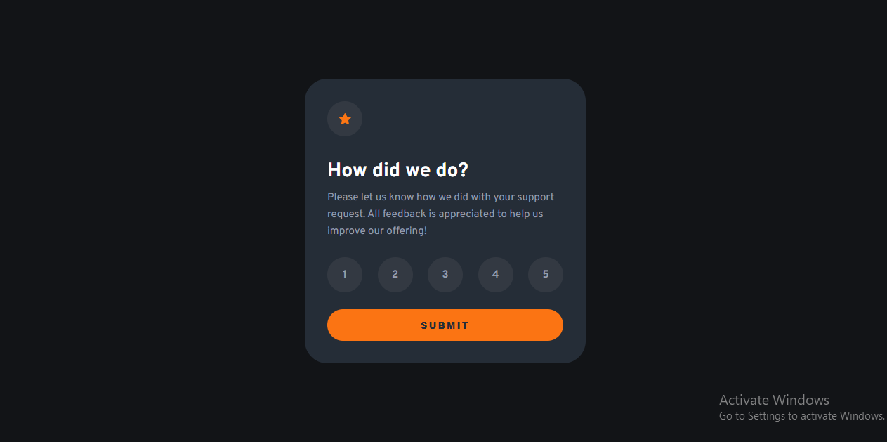

# Interactive Rating Component | Frontend Mentor

This is a solution to the Interactive Rating Component challenge on Frontend Mentor. It is a simple and interactive UI that allows users to select a rating and submit their feedback.

---

## Table of Contents

- [Overview](#overview)
  - [The Challenge](#the-challenge)
  - [Screenshot](#screenshot)
  - [Links](#links)
- [My Process](#my-process)
  - [Built With](#built-with)
  - [What I Learned](#what-i-learned)
  - [Continued Development](#continued-development)
- [Author](#author)

---

## Overview

### The Challenge

Users should be able to:

- Select a rating from 1 to 5
- Submit their selected rating
- See a "Thank You" state after submission
- View hover and active states for interactive elements
- Experience a responsive layout across devices

---

### Screenshot

---

### Links

- Repository:  
  https://github.com/IrfanAnsari21/interactive-rating-component.git  

- Live Site:  
  https://irfanansari21.github.io/interactive-rating-component/

---

## My Process

### Built With

- Semantic HTML5
- CSS (Flexbox / Responsive Design)
- JavaScript (DOM Manipulation)
- Mobile-first workflow

---

### What I Learned

- Handling user interactions with JavaScript
- Managing state (selected rating)
- Updating UI dynamically after submission
- Working with event listeners
- Improving user experience with interactive feedback

---

### Continued Development

- Add keyboard accessibility (a11y improvements)
- Improve focus states for better UX
- Refactor JavaScript for better structure
- Enhance responsiveness and UI polish

---

## Author

- GitHub:  
  https://github.com/IrfanAnsari21  

- Frontend Mentor:  
  https://www.frontendmentor.io/profile/IrfanAnsari21

---

## Acknowledgments

Thanks to **Frontend Mentor** for providing this challenge to improve real-world frontend skills.